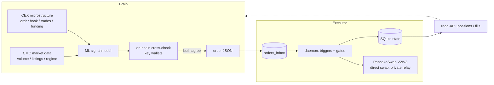

# Alpha Radar — Predictive Trading Agent

Autonomous BNB-chain trading agent whose brain runs ML over CEX and CMC market
data to flag moves *before* they happen, then cross-checks a set of key on-chain
wallets to confirm the signal before the executor ever touches the chain.


## What it is

A trading agent split into two halves that talk over a simple file/JSON contract:

- **Brain (signal layer)** — predicts short-horizon moves from CEX microstructure
  (order book, trades, funding) and CoinMarketCap market data, then *validates*
  each candidate against the recent behaviour of a curated list of key wallets
  on-chain. A signal only becomes an order when both the statistical model and the
  on-chain flow agree.
- **Executor (this skeleton, implemented)** — takes the brain's orders and runs
  them on BSC: market / limit buy+sell and conditional exits (take-profit,
  stop-loss, trailing). It does not think — it executes deterministically,
  idempotently, and survives restarts.

This repository currently ships the **execution engine** in full, plus the
contract the brain plugs into. The ML signal layer and the on-chain
cross-checker are being wired in next (see Status).

## The edge

Most agents react to price. The thesis here is to act one step earlier:

1. **Anticipate** — ML on CEX/CMC data flags a likely move before it shows up on
   the candle (imbalance, funding dislocation, listing/volume regime shifts).
2. **Confirm** — cross-check key wallets on-chain. If the wallets that usually
   front a move are already rotating in, conviction goes up; if not, the signal
   is discarded. This filters out the model's false positives with real flow.
3. **Execute** — only confirmed signals reach the executor, which then manages
   the position with hard risk rules.

## How it works



The two halves are decoupled on purpose: the brain writes order JSON into an
inbox atomically, the executor picks it up, fills it, and exposes a read-only
status API the brain polls for positions and fills. Either half can be iterated
or restarted without breaking the other.

## Status

**Implemented and battle-tested with real funds:**

- Direct PancakeSwap **V2 + V3** path (quote + swap, best-output routing).
- Trigger engine: limit entry + take-profit / stop-loss / trailing, in one place.
- Resident daemon: inbox orders + engine tick + risk gates, idempotent, with
  cancel, a per-wallet nonce manager + gap watchdog, RPC rotation, and SQLite
  persistence that survives restarts.
- Read-only status API for the brain; Telegram alerts + heartbeat.
- Unit-tested; many rounds of adversarial review behind it.

**Roadmap (the strategy layer — being wired in now):**

- ML signal model on CEX microstructure + CMC market data.
- On-chain key-wallet cross-checker as the confirmation gate.
- Per-token slippage tuning and an independent price sanity-check against the
  CMC data feed before send.
- Backtest harness for the signal layer.

The execution skeleton below is real and runnable today; the brain plugs into
the documented order/status contract.

## Architecture

| Module | Role |
| --- | --- |
| `src/models.py` | Order (market/limit, TP/SL/trailing) and result types |
| `src/config.py` | config, per-token slippage, whitelist, risk gates, secret loading |
| `src/rpc.py` | RPC pool: rotation + retry; primary on a private/MEV relay for tx |
| `src/nonce.py` | per-wallet nonce under lock, no collisions |
| `src/direct_adapter.py` | PancakeSwap V2/V3 swap: receipt check, fill from balance delta, multi-hop via USDT, gas reserve, preflight |
| `src/executor.py` | market-swap routing (direct / aggregator) |
| `src/triggers.py` | single engine: limit entry + TP + SL + trailing |
| `src/store.py` | SQLite (WAL): triggers, fill journal, idempotency |
| `src/daemon.py` | resident process: inbox orders + engine tick + risk gates |
| `src/runner.py` | one-shot run (+ `--dry-run`) |
| `src/status.py` | read-only state API for the brain |
| `src/register.py` | contest registration |
| `src/keystore.py` | scrypt keystore for private keys |
| `src/openocean.py` | optional aggregator routing |

## Usage

```bash
python -m venv .venv && . .venv/bin/activate
pip install -r requirements.txt
cp config.example.yaml config.yaml   # fill wallets/keys and number placeholders
```

Safe first run (spends nothing):

```bash
echo '{"wallet":"body1","side":"buy","token":"0x55d3...955","amount":0.01}' \
  | python -m src.runner --config config.yaml --order - --dry-run
```

Live (resident daemon):

```bash
python -m src.daemon --config config.yaml   # holds triggers + accepts orders
# brain drops order JSON into orders_inbox/*.json, results land in results/
```

Order schema (prices are BNB per 1 whole token):

```text
market buy           {"wallet":"body1","side":"buy","token":"0x..","amount":0.05}
+ TP/SL/trailing     add "take_profit_pct":0.2,"stop_loss_pct":0.1,"trailing_pct":0.08
limit buy            {...,"type":"limit","trigger_price":<BNB per token>}
sell all             {"wallet":"body1","side":"sell","token":"0x..","sell_all":true}
cancel               {"cancel":"<client_order_id>"}
```

Read state:

```bash
python -m src.status --config config.yaml [--wallet body1] [--fills 50]
```

Tests:

```bash
python -m pytest tests/ -q
```

## Risk and safety

- **MEV:** transactions are sent only through a private/MEV relay, so they do not
  hit the public mempool — sandwich protection at send time.
- **Risk gates:** max-drawdown and minimum-trades-per-day gates live in config
  (off by default until the strategy numbers are set).
- **Idempotency:** every order carries a `client_order_id`; replays and cancels
  are deduplicated, and state persists across restarts.

## The contest, briefly

Built for BNB Hack Track 1: an autonomous agent that registers on the contest
contract and trades on-chain within a hard max-drawdown constraint. The design
goal is survival plus convexity — predict early, confirm with flow, and let the
risk engine cap the downside.

## Disclaimer

Experimental software for a hackathon. Trades real funds at your own risk. No
warranty; nothing here is financial advice. Keep private keys out of the repo —
this project loads them from env or an encrypted keystore, never from tracked
files.
